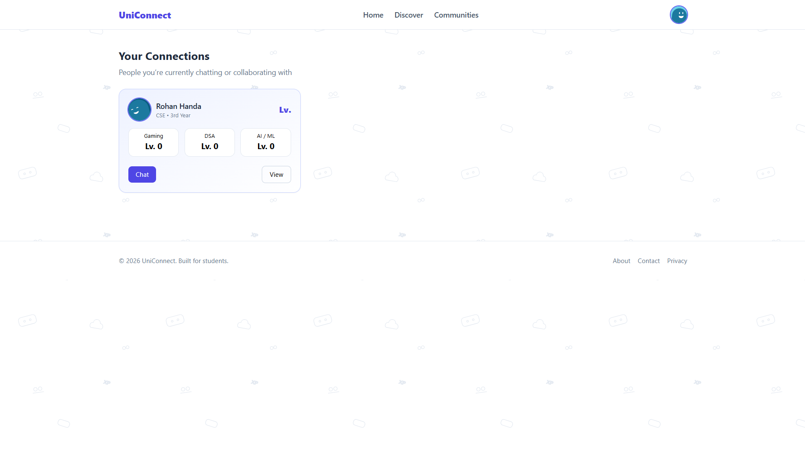
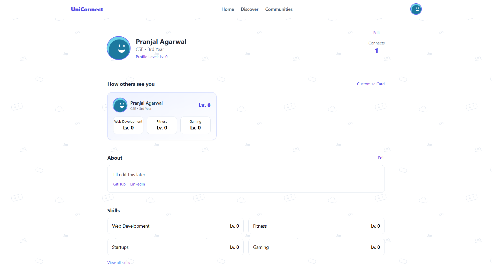
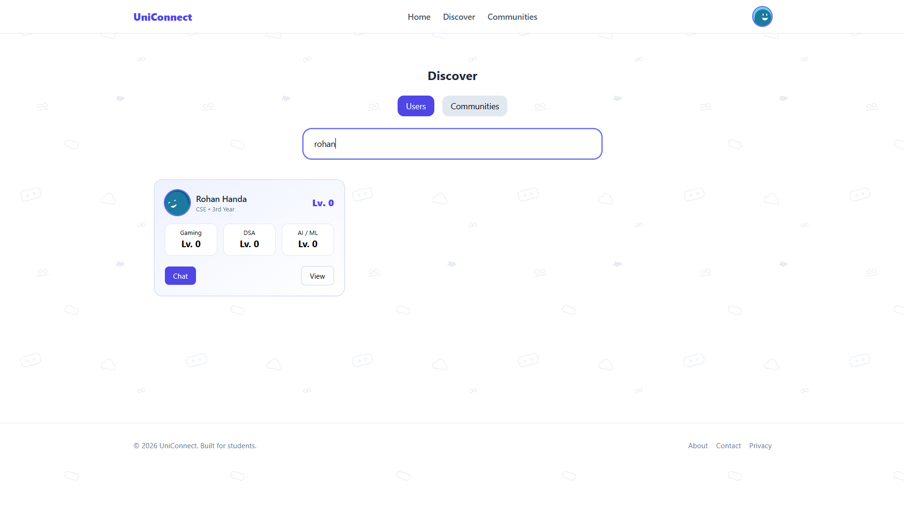
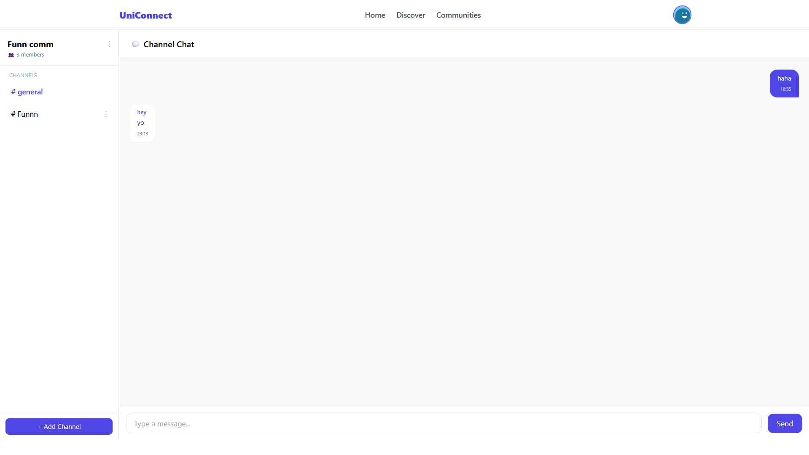

# Uni-Connect

A real-time community messaging platform built with the MERN stack and Socket.io.

## Live Demo

[View Live](https://u-niconnect.netlify.app/)

## Screenshots









## Features

- Community-based chat rooms
- Private messaging
- Real-time communication using Socket.io
- Gamified XP system to encourage engagement
- Secure authentication using JWT

## Tech Stack

Frontend:

- React
- Tailwind CSS

Backend:

- Node.js
- Express.js

Database:

- MongoDB

Real-Time Communication:

- Socket.io

Authentication:

- JWT

## Installation

Clone the repository

```bash
git clone https://github.com/55Pranjal/uni-connect.git
```

Install dependencies

npm install

Run the development server

npm run dev

## Future Improvements

Project collaboration feature

File sharing in chats

Notifications
